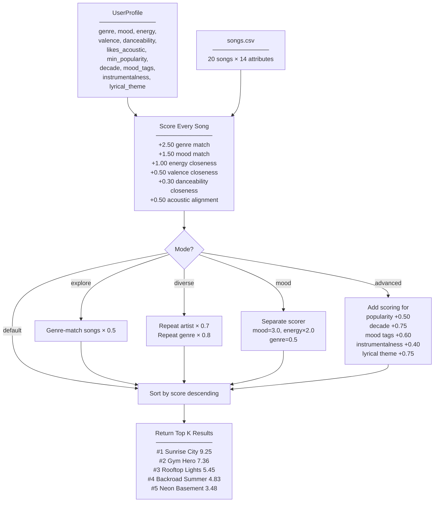
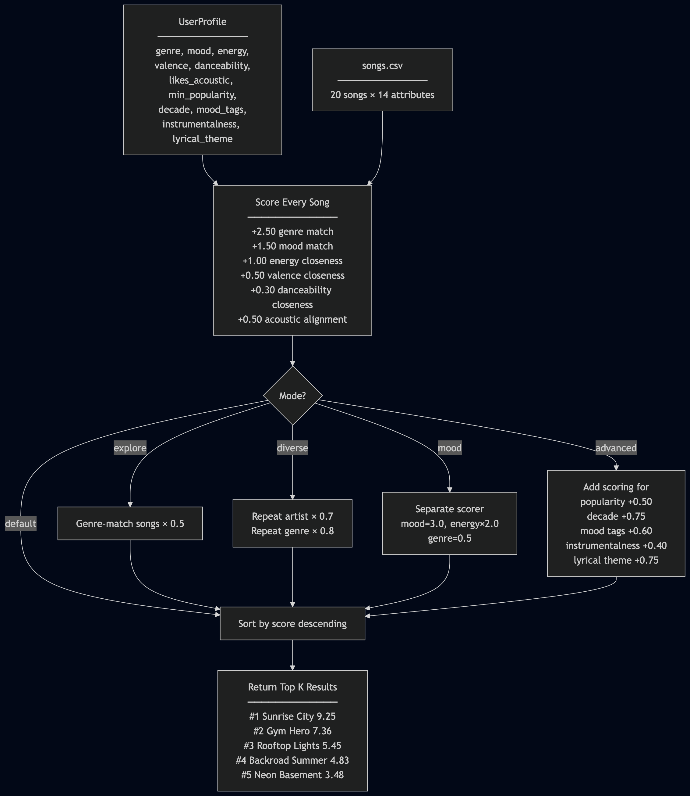
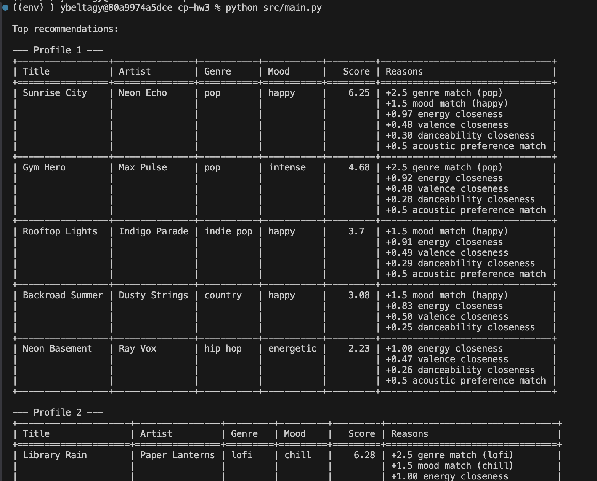

# 🎵 Music Recommender Simulation

## Project Summary

This is a content-based music recommender that scores songs from a 20-track catalog against user taste profiles. Each song has 14 attributes (genre, mood, energy, valence, danceability, acousticness, popularity, release decade, mood tags, instrumentalness, tempo, title, artist, and lyrical theme). The system computes a weighted score for each song based on how closely it matches a user's preferences, then returns the top results ranked by score. It supports five recommendation modes: default, explore, diverse, mood, and advanced.

---

## How The System Works

### Song Features

Each `Song` carries 14 attributes:
- Text: title, artist
- Categorical: genre, mood, release_decade, lyrical_theme
- Numerical (0–1): energy, valence, danceability, acousticness, instrumentalness
- Numerical (other): tempo_bpm (60–152), popularity (0–100)
- List: mood_tags (e.g., ["euphoric", "uplifting"])

### User Profile

A `UserProfile` stores:
- Preferred genre and mood (exact-match targets)
- Target values for energy, valence, danceability, instrumentalness (numerical closeness targets)
- Boolean acoustic preference
- Minimum popularity threshold
- Preferred decade, mood tags, and lyrical theme

### Scoring Logic

The default scorer (`score_song`) works like this:
1. Genre match: +2.5 points if the song's genre exactly matches the user's favorite
2. Mood match: +1.5 points for exact mood match
3. Energy closeness: `(1 - |user_energy - song_energy|) × 1.0` — up to 1.0 points
4. Valence closeness: same formula × 0.5
5. Danceability closeness: same formula × 0.3
6. Acoustic alignment: +0.5 if the song's acousticness (≥0.5 or <0.5) matches the user's boolean preference

The advanced scorer adds: popularity threshold (+0.5), decade match (+0.75), mood tag overlap (+0.3 per tag, max 0.6), instrumentalness closeness (×0.4), and lyrical theme match (+0.75).

### How Songs Are Chosen

All songs are scored, sorted by score descending, and the top k (default 5) are returned. Different modes modify this:
- **explore**: penalizes songs matching the user's genre by 50%
- **diverse**: penalizes repeat artists (-30%) and repeat genres (-20%) as results are selected
- **mood**: uses a separate scoring function that weights mood (3.0) and energy (×2.0) heavily, genre only 0.5
- **advanced**: uses all 15 attributes in scoring

### Diagram





---

## Getting Started

### Setup

1. Create a virtual environment (optional but recommended):

   ```bash
   python -m venv env
   source env/bin/activate      # Mac or Linux
   env\Scripts\activate         # Windows
   ```

2. Install dependencies:

   ```bash
   pip install -r requirements.txt
   ```

3. Run the app:

   ```bash
   python src/main.py
   python src/main.py --mode explore
   python src/main.py --mode diverse
   python src/main.py --mode mood
   python src/main.py --mode advanced
   ```

Sample output for all modes is in the `output` folder. Here is a small screenshot as a reference.



### Running Tests

```bash
python -m pytest tests/ -v 
```

Tests are in `tests/test_recommender.py`.

---

## Experiments You Tried

- **Explore mode (genre penalty -50%)**: In default mode, Profile A's top 2 are both pop songs (Sunrise City at 6.25, Gym Hero at 4.68). In explore mode, "Rooftop Lights" (indie pop, 3.70) jumped to #1 while "Sunrise City" dropped to 3.12. This surfaced adjacent genres the user might enjoy but would never see in default mode.

- **Diverse mode (artist/genre repeat penalties)**: In default mode, Profile B gets 3 lofi tracks in the top 3 (Library Rain, Midnight Coding, Focus Flow). Diverse mode penalized the repeat lofi/LoRoom entries — Midnight Coding dropped from 6.20 to 4.96 and Focus Flow from 4.73 to 2.65, letting "Spacewalk Thoughts" (ambient) move up to #3. The lofi tracks still appeared but with lower scores, pushing variety higher in the ranking.

- **Adversarial profile (energy 0.95 + mood sad)**: The system returned "Gym Hero" (pop, intense, 4.54) and "Sunrise City" (pop, happy, 4.38) as the top results — neither is sad. The actual sad songs ("Velvet Dusk" at 3.36, "Rainy Window" at 2.36) ranked lower because genre match (+2.5) outweighed mood match (+1.5). This exposed that the scorer treats features independently with no concept of coherence.

- **Adding 5 new attributes (advanced mode)**: "Sunrise City" went from 6.25 (default) to 9.25 (advanced) for Profile A because it matched on mood tags (euphoric + uplifting, +0.60), decade (2020s, +0.75), lyrical theme (party, +0.75), popularity (78 >= 50, +0.50), and instrumentalness closeness (+0.40). The new attributes added nearly 3 points of meaningful differentiation.

- **Mood mode (mood=3.0, energy×2.0, genre=0.5)**: Flipping the weights made cross-genre recommendations viable. For Profile A, "Backroad Summer" (country, happy) scored 6.45 in mood mode vs 3.08 in default — the mood match alone (3.0 pts) nearly equaled the default genre+mood combined (4.0 pts). This showed how weight choices determine whether the system recommends within a genre or across genres.

---

## Limitations and Risks

- **Tiny catalog**: Only 20 songs across 12 genres. Many user profiles have 0–2 genre matches, making recommendations sparse.
- **No collaborative filtering**: The system only uses song attributes, not listening behavior from other users. It cannot discover "people like you also liked X."
- **Independent feature scoring**: Features are scored and summed independently. The system cannot detect contradictory preferences (e.g., high energy + sad mood) or penalize incoherent combinations.
- **Static weights**: The same weights apply to all users. A user who cares deeply about lyrics but not energy gets the same weight distribution as everyone else.
- **Genre bias**: With genre worth 2.5 points (the single largest factor), the system strongly favors same-genre songs even when cross-genre matches might be better.
- **No temporal context**: It doesn't consider time of day, activity, or listening history. A "gym" playlist and a "sleep" playlist for the same user would need separate profiles.
- **Popularity bias in advanced mode**: Songs above the popularity threshold get a flat bonus, which could systematically suppress lesser-known tracks.

---

## Reflection

[**Model Card**](model_card.md)

Building this recommender showed how much of a recommendation is just arithmetic on features — genre match worth X points, energy closeness worth Y. The system feels "smart" when the weights happen to align with what a human would pick, but it has no understanding of music. Every recommendation is a mechanical sum of independent scores.

The bias risks became clear with the adversarial profiles. A user asking for "sad + high energy" gets cheerful pop songs because the math works out — genre and energy points overwhelm the missing mood match. In a real product, this kind of silent failure could push users toward content that doesn't match their emotional state, or systematically underserve users whose tastes don't fit the weight assumptions. The weights themselves encode a worldview about what matters in music preference, and that worldview is baked in by whoever designs the system, not learned from the users it serves.
